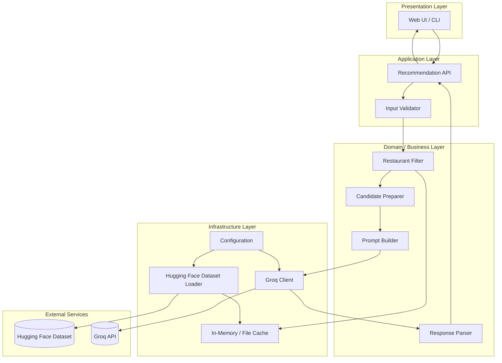
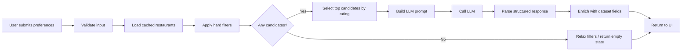
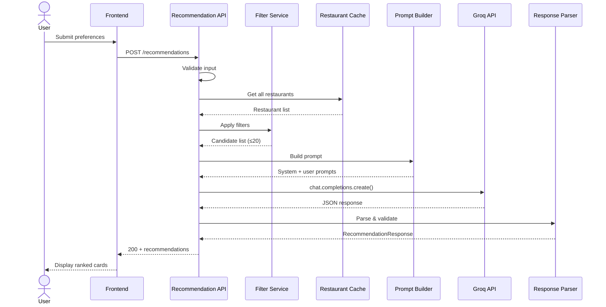
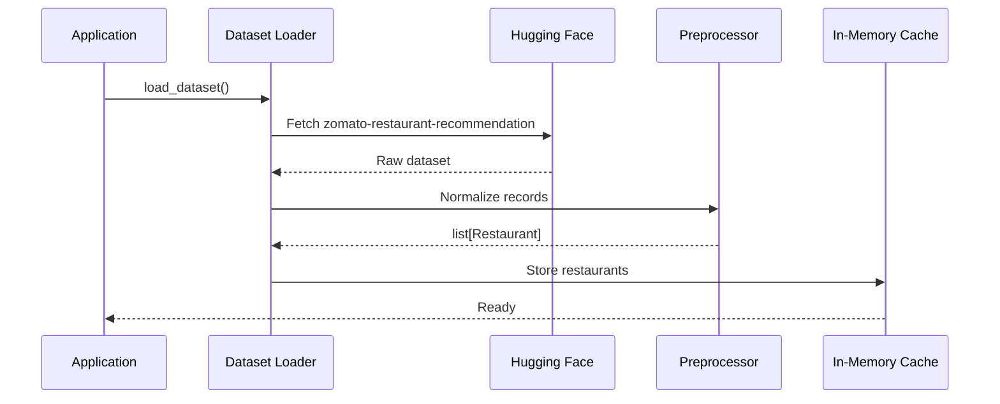
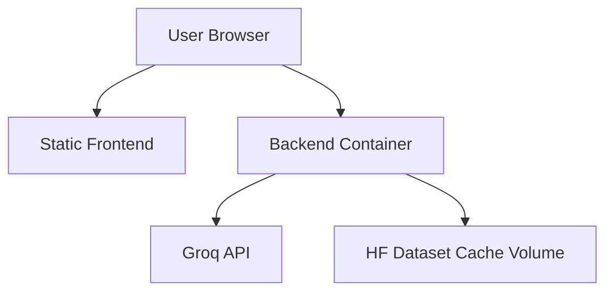

# Architecture: AI-Powered Restaurant Recommendation System

> Derived from [`context.md`](./context.md), [`edge-case.md`](./edge-case.md), and [`problemStatement.txt`](./problemStatement.txt)

---

## Table of Contents

1. [Executive Summary](#1-executive-summary)
2. [Architectural Goals](#2-architectural-goals)
3. [High-Level Architecture](#3-high-level-architecture)
4. [Component Design](#4-component-design)
5. [Data Architecture](#5-data-architecture)
6. [Recommendation Pipeline](#6-recommendation-pipeline)
7. [LLM Integration Layer](#7-llm-integration-layer)
8. [API Design](#8-api-design)
9. [Frontend Architecture](#9-frontend-architecture)
10. [Project Structure](#10-project-structure)
11. [Technology Stack](#11-technology-stack)
12. [Sequence Flows](#12-sequence-flows)
13. [Non-Functional Requirements](#13-non-functional-requirements)
14. [Error Handling & Fallbacks](#14-error-handling--fallbacks)
15. [Security Considerations](#15-security-considerations)
16. [Deployment Architecture](#16-deployment-architecture)
17. [Future Extensions](#17-future-extensions)

---

## 1. Executive Summary

This system is a **hybrid recommendation engine** that combines:

- **Deterministic filtering** over a structured Zomato restaurant dataset (Hugging Face)
- **Probabilistic reasoning** via **Groq** (LLM inference API) to rank candidates and generate natural-language explanations

The architecture follows a **layered, pipeline-oriented design**: user preferences enter at the presentation layer, pass through a filtering and prompt-construction integration layer, are processed by a **Groq-powered** recommendation engine, and return as structured, explainable results to the UI.

```
┌─────────────┐    ┌──────────────┐    ┌─────────────────┐    ┌──────────────┐    ┌─────────────┐
│  User Input │───▶│ Data Filter  │───▶│ Integration     │───▶│ LLM Engine   │───▶│ UI Output   │
│  (Prefs)    │    │ & Preprocess │    │ (Prompt Builder)│    │ (Groq API)   │    │ (Results)   │
└─────────────┘    └──────────────┘    └─────────────────┘    └──────────────┘    └─────────────┘
```

---

## 2. Architectural Goals

| Goal | Description |
|------|-------------|
| **Accuracy** | Recommendations must reflect user-stated location, budget, cuisine, and rating constraints |
| **Explainability** | Every recommendation includes an AI-generated rationale tied to user preferences |
| **Separation of concerns** | Data loading, filtering, LLM calls, and UI are isolated modules |
| **Testability** | Filtering logic is unit-testable without LLM calls; LLM layer is mockable |
| **Extensibility** | Groq client is abstracted behind `LLMProvider`; easy to add new preference fields or plug in vector search later |
| **User clarity** | Output is scannable: name, cuisine, rating, cost, and explanation |

---

## 3. High-Level Architecture

### 3.1 Logical Layers



### 3.2 Architectural Style

- **Pattern:** Layered architecture with a **pipeline** for the recommendation flow
- **Integration style:** Synchronous request/response for MVP (user submits prefs → receives ranked list)
- **Data strategy:** Load dataset once at startup (or on first request), cache in memory as a normalized DataFrame or list of domain objects

---

## 4. Component Design

### 4.1 Data Ingestion Module

**Responsibility:** Load, clean, and normalize the Zomato dataset from Hugging Face.

| Aspect | Detail |
|--------|--------|
| **Source** | `ManikaSaini/zomato-restaurant-recommendation` on Hugging Face |
| **Load strategy** | `datasets.load_dataset()` at application startup |
| **Output** | Normalized collection of `Restaurant` domain objects |

**Preprocessing steps:**

1. Download/load dataset split(s)
2. Map raw columns to canonical schema (see [§5 Data Model](#51-restaurant-entity))
3. Normalize location strings (trim, title-case city names)
4. Parse cuisine field (may be comma-separated → list)
5. Coerce rating to float; handle missing/invalid values
6. Map cost to budget tier (`low` / `medium` / `high`) using configurable thresholds
7. Drop or flag rows with critical missing fields (name, location)

```python
# Conceptual interface
class DatasetLoader:
    def load(self) -> list[Restaurant]: ...
    def get_cities(self) -> list[str]: ...
    def get_cuisines(self) -> list[str]: ...
```

---

### 4.2 User Input Module

**Responsibility:** Collect and validate user preferences before recommendation.

**Input schema:**

```json
{
  "location": "Bangalore",
  "budget": "medium",
  "cuisine": "Italian",
  "min_rating": 4.0,
  "additional_preferences": "family-friendly, outdoor seating"
}
```

| Field | Type | Required | Validation |
|-------|------|----------|------------|
| `location` | string | Yes | Must match a known city in dataset (or fuzzy match) |
| `budget` | enum | Yes | One of: `low`, `medium`, `high` |
| `cuisine` | string | No | Partial match against cuisine list |
| `min_rating` | float | No | Range 0.0–5.0, default 0.0 |
| `additional_preferences` | string | No | Free-text, passed to LLM for soft matching |

---

### 4.3 Filter Module

**Responsibility:** Deterministically narrow the restaurant corpus before LLM invocation.

**Filter pipeline (applied in order):**

1. **Location filter** — exact or case-insensitive match on city/location field
2. **Rating filter** — `rating >= min_rating`
3. **Cuisine filter** — restaurant cuisines contain requested cuisine (if provided)
4. **Budget filter** — restaurant cost tier matches user budget (if mappable)

**Design decision:** Hard filters reduce LLM token usage and prevent hallucinated restaurants. Only real, filtered candidates are passed to the LLM.

```python
class RestaurantFilter:
    def filter(
        self,
        restaurants: list[Restaurant],
        preferences: UserPreferences
    ) -> list[Restaurant]: ...
```

**Fallback:** If zero results after hard filters, relax constraints in order (cuisine → budget → min_rating) and inform the user which constraint was relaxed.

---

### 4.4 Integration Layer (Prompt Builder)

**Responsibility:** Transform filtered restaurant records and user preferences into a structured LLM prompt.

**Inputs:**

- User preference object
- Top-N candidate restaurants (cap at 15–20 to control token cost)

**Outputs:**

- System prompt (role, constraints, output format)
- User prompt (preferences + serialized restaurant list)

**Key design rules:**

- Instruct the LLM to **only recommend from the provided list** (no fabrication)
- Require **JSON or structured output** for reliable parsing
- Ask for ranking, per-item explanation, and optional summary

---

### 4.5 Recommendation Engine (Groq)

**Responsibility:** Rank filtered candidates and generate human-like explanations using the **Groq API**.

**Provider:** [Groq](https://groq.com/) — high-speed LLM inference with OpenAI-compatible chat completions.

**LLM tasks:**

| Task | Description |
|------|-------------|
| **Rank** | Order restaurants by fit to user preferences |
| **Explain** | 1–2 sentences per restaurant on why it matches |
| **Summarize** | Optional overview of the recommendation set |

**Output contract:**

```json
{
  "summary": "Based on your preference for Italian cuisine in Bangalore with a medium budget...",
  "recommendations": [
    {
      "restaurant_name": "Truffles",
      "rank": 1,
      "cuisine": "Italian, Continental",
      "rating": 4.5,
      "estimated_cost": "₹800 for two",
      "explanation": "Highly rated Italian spot within your budget, known for family-friendly ambiance."
    }
  ]
}
```

---

### 4.6 Output Display Module

**Responsibility:** Render recommendations in a clear, user-friendly format.

**Required display fields (per context):**

- Restaurant Name
- Cuisine
- Rating
- Estimated Cost
- AI-generated explanation

**Optional UI enhancements:**

- Rank badge (#1, #2, #3)
- Summary banner at top
- "No results" state with suggestions to broaden search
- Loading state during LLM call

---

## 5. Data Architecture

### 5.1 Restaurant Entity

```python
@dataclass
class Restaurant:
    name: str
    location: str          # City / locality
    cuisines: list[str]
    rating: float
    cost_for_two: str      # Raw string from dataset, e.g. "₹500"
    budget_tier: str       # Derived: low | medium | high
    address: str | None = None
    rest_type: str | None = None   # e.g. Casual Dining, Cafe
    votes: int | None = None
```

### 5.2 User Preferences Entity

```python
@dataclass
class UserPreferences:
    location: str
    budget: Literal["low", "medium", "high"]
    cuisine: str | None = None
    min_rating: float = 0.0
    additional_preferences: str | None = None
```

### 5.3 Recommendation Result Entity

```python
@dataclass
class Recommendation:
    restaurant_name: str
    rank: int
    cuisine: str
    rating: float
    estimated_cost: str
    explanation: str

@dataclass
class RecommendationResponse:
    summary: str | None
    recommendations: list[Recommendation]
    filters_relaxed: list[str] | None = None
```

### 5.4 Budget Tier Mapping

| Tier | Typical Cost for Two (INR) | Notes |
|------|---------------------------|-------|
| `low` | ≤ ₹500 | Configurable thresholds |
| `medium` | ₹501 – ₹1500 | Parsed from dataset cost field |
| `high` | > ₹1500 | Fallback if unparseable: use median split |

### 5.5 Dataset Source

| Property | Value |
|----------|-------|
| Platform | Hugging Face Datasets |
| Identifier | `ManikaSaini/zomato-restaurant-recommendation` |
| URL | https://huggingface.co/datasets/ManikaSaini/zomato-restaurant-recommendation |
| Cache | Local disk via Hugging Face `cache_dir` or in-memory after first load |

---

## 6. Recommendation Pipeline

### 6.1 End-to-End Pipeline



### 6.2 Pipeline Stages

| Stage | Type | Latency impact |
|-------|------|----------------|
| Input validation | Sync, in-process | ~1 ms |
| Filter | Sync, in-process | ~5–50 ms (depends on dataset size) |
| Prompt construction | Sync, in-process | ~1 ms |
| LLM inference | Sync Groq API call | ~1–5 s (Groq LPU) |
| Response parsing | Sync, in-process | ~1 ms |

### 6.3 Candidate Selection Strategy

Before sending to LLM:

1. Apply all hard filters
2. Sort by rating (descending), then by vote count if available
3. Take top **15–20** candidates (configurable `MAX_CANDIDATES`)
4. Serialize as compact JSON in prompt

This balances recommendation quality with token cost and latency.

---

## 7. LLM Integration Layer (Groq)

Groq is the **designated LLM provider** for this project. All recommendation ranking and explanation generation goes through the Groq Chat Completions API via the official `groq` Python SDK.

### 7.1 Groq Client

```python
from groq import Groq

class GroqLLMClient:
    def __init__(self, api_key: str, model: str = "llama-3.3-70b-versatile"):
        self.client = Groq(api_key=api_key)
        self.model = model

    def generate(self, system_prompt: str, user_prompt: str) -> str:
        response = self.client.chat.completions.create(
            model=self.model,
            messages=[
                {"role": "system", "content": system_prompt},
                {"role": "user", "content": user_prompt},
            ],
            temperature=0.3,
            response_format={"type": "json_object"},
        )
        return response.choices[0].message.content
```

**Configuration (via environment variables):**

| Variable | Description | Example |
|----------|-------------|---------|
| `GROQ_API_KEY` | Groq API key (required) | `gsk_...` |
| `GROQ_MODEL` | Model identifier (optional) | `llama-3.3-70b-versatile` |

**Recommended Groq models:**

| Model | Use case | Notes |
|-------|----------|-------|
| `llama-3.3-70b-versatile` | **Default** — ranking & explanations | Best balance of quality and reasoning |
| `llama-3.1-8b-instant` | Fast fallback / dev testing | Lower latency, lower cost |
| `mixtral-8x7b-32768` | Alternative for longer prompts | Larger context window |

The client implements a generic `LLMProvider` protocol so the recommendation service remains decoupled from Groq-specific details in tests and future refactors.

### 7.2 Prompt Template Structure

**System prompt (concise):**

```
You are a restaurant recommendation assistant for an app like Zomato.
You MUST only recommend restaurants from the provided list.
Rank them by how well they match the user's preferences.
Return valid JSON matching the specified schema.
Do not invent restaurant names or details not in the list.
```

**User prompt (structured):**

```
User Preferences:
- Location: {location}
- Budget: {budget}
- Cuisine: {cuisine}
- Minimum Rating: {min_rating}
- Additional: {additional_preferences}

Candidate Restaurants (JSON):
{candidates_json}

Return top 5 recommendations as JSON with fields:
summary, recommendations[{restaurant_name, rank, cuisine, rating, estimated_cost, explanation}]
```

### 7.3 Response Parsing

1. Extract JSON from LLM response (handle markdown code fences)
2. Validate against schema
3. Cross-check `restaurant_name` against candidate list (anti-hallucination)
4. Fill missing fields from dataset if LLM omits them
5. On parse failure → retry once with stricter prompt, then fallback to rating-sorted list with template explanations

---

## 8. API Design

### 8.1 REST Endpoints (Backend)

| Method | Path | Description |
|--------|------|-------------|
| `GET` | `/health` | Health check |
| `GET` | `/metadata/cities` | List available cities from dataset |
| `GET` | `/metadata/cuisines` | List available cuisines |
| `POST` | `/recommendations` | Generate recommendations |

### 8.2 POST `/recommendations`

**Request:**

```json
{
  "location": "Bangalore",
  "budget": "medium",
  "cuisine": "Italian",
  "min_rating": 4.0,
  "additional_preferences": "family-friendly"
}
```

**Response (200):**

```json
{
  "summary": "Here are the best Italian restaurants in Bangalore matching your medium budget...",
  "recommendations": [
    {
      "restaurant_name": "Example Restaurant",
      "rank": 1,
      "cuisine": "Italian",
      "rating": 4.5,
      "estimated_cost": "₹800 for two",
      "explanation": "Matches your cuisine and budget preferences with strong ratings."
    }
  ],
  "filters_relaxed": null
}
```

**Error responses:**

| Status | Condition |
|--------|-----------|
| `400` | Invalid input (unknown budget tier, bad rating range) |
| `404` | No restaurants found even after filter relaxation |
| `502` | Groq API error (timeout, rate limit, server error) |
| `503` | Dataset not loaded |

---

## 9. Frontend Architecture

### 9.1 Recommended Approach (MVP)

**Option A — Streamlit (fastest MVP):**

- Single Python file for form + results
- Calls backend service or inline pipeline
- Ideal for demos and milestone submission

**Option B — React + FastAPI (production-oriented):**

- React form components for preferences
- FastAPI backend exposing `/recommendations`
- Card-based results layout

### 9.2 UI Component Breakdown

```
App
├── PreferenceForm
│   ├── LocationSelect
│   ├── BudgetSelect
│   ├── CuisineSelect
│   ├── RatingSlider
│   └── AdditionalPreferencesTextarea
├── SubmitButton
├── LoadingIndicator
└── ResultsPanel
    ├── SummaryBanner
    └── RecommendationCard (×N)
        ├── RankBadge
        ├── RestaurantName
        ├── CuisineTag
        ├── RatingStars
        ├── CostLabel
        └── ExplanationText
```

### 9.3 UX Flow

1. User lands on form with dropdowns populated from `/metadata/*`
2. User fills preferences and clicks "Get Recommendations"
3. Loading spinner while LLM processes
4. Results appear as ranked cards with explanations
5. Empty/error states guide user to adjust filters

---

## 10. Project Structure

```
Zomato-Milestone1/
├── docs/
│   ├── problemStatement.txt
│   ├── context.md
│   └── architecture.md         # this file
├── src/
│   ├── __init__.py
│   ├── main.py                 # App entry point (FastAPI / Streamlit)
│   ├── config.py               # GROQ_API_KEY, GROQ_MODEL, thresholds
│   ├── models/
│   │   ├── restaurant.py
│   │   ├── preferences.py
│   │   └── recommendation.py
│   ├── data/
│   │   ├── loader.py           # Hugging Face dataset loading
│   │   └── preprocessor.py     # Cleaning & normalization
│   ├── services/
│   │   ├── filter.py           # Hard filtering logic
│   │   ├── prompt_builder.py   # LLM prompt construction
│   │   ├── llm_client.py       # Groq API client (implements LLMProvider)
│   │   ├── response_parser.py  # JSON extraction & validation
│   │   └── recommendation.py   # Orchestrates full pipeline
│   └── api/
│       ├── routes.py
│       └── schemas.py          # Pydantic request/response models
├── frontend/                   # Optional: React app
├── tests/
│   ├── test_filter.py
│   ├── test_preprocessor.py
│   └── test_prompt_builder.py
├── .env.example
├── requirements.txt
└── README.md
```

---

## 11. Technology Stack

### 11.1 Recommended Stack (Python MVP)

| Layer | Technology | Rationale |
|-------|-----------|-----------|
| Language | Python 3.10+ | Rich ML/data ecosystem, Hugging Face SDK |
| Dataset | `datasets` (Hugging Face) | Direct load from specified dataset |
| Data processing | `pandas` | Filtering, cleaning, aggregation |
| Backend API | `FastAPI` | Async, auto OpenAPI docs, Pydantic validation |
| LLM provider | **Groq** | Fast inference, generous free tier, JSON mode support |
| LLM SDK | `groq` | Official Groq Python SDK for chat completions |
| Frontend (MVP) | `streamlit` | Rapid UI for milestone demo |
| Frontend (alt.) | React + Tailwind | Polished production UI |
| Config | `python-dotenv` | API keys via environment variables |
| Testing | `pytest` | Unit tests for filter and parser |

### 11.2 Key Dependencies

```
datasets
pandas
fastapi
uvicorn
streamlit          # if using Streamlit UI
groq               # Groq LLM inference SDK
pydantic
python-dotenv
pytest
```

---

## 12. Sequence Flows

### 12.1 Happy Path — Recommendation Request



### 12.2 Startup — Dataset Load



---

## 13. Non-Functional Requirements

| Requirement | Target | Approach |
|-------------|--------|----------|
| **Response time** | < 10 s end-to-end | Groq LPU inference is fast; cap candidates; default to `llama-3.3-70b-versatile` |
| **Availability** | MVP: single instance | Health check endpoint |
| **Scalability** | Horizontal later | Stateless API; cache dataset per instance |
| **Maintainability** | Modular services | Clear interfaces per component |
| **Cost control** | Minimize LLM tokens | Hard filter first; send ≤20 candidates |
| **Reliability** | Graceful LLM failures | Fallback to rating-sorted results |

---

## 14. Error Handling & Fallbacks

| Scenario | Handling |
|----------|----------|
| Dataset load fails | Log error; return 503; retry on next request |
| No filter matches | Relax filters sequentially; notify user in response |
| LLM timeout | Retry once; fallback to deterministic ranking |
| LLM invalid JSON | Retry with "JSON only" prompt; fallback parser |
| Hallucinated restaurant | Reject names not in candidate list |
| Missing `GROQ_API_KEY` | Fail fast at startup with clear error message |
| Groq rate limit | Retry once with backoff; fallback to deterministic ranking |

**Deterministic fallback (no LLM):**

When LLM is unavailable, return top-5 candidates sorted by rating with a template explanation:

> "Recommended based on your filters: {location}, {budget} budget, rating ≥ {min_rating}."

---

## 15. Security Considerations

| Concern | Mitigation |
|---------|------------|
| API key exposure | Store `GROQ_API_KEY` in `.env`; never commit secrets |
| Prompt injection | Sanitize free-text preferences; instruct LLM to ignore override attempts |
| Rate limiting | Optional: limit requests per IP for public deployment |
| Input validation | Strict Pydantic schemas; reject oversized payloads |
| CORS | Configure allowed origins if frontend is separate |

---

## 16. Deployment Architecture

### 16.1 Local Development

```
Developer Machine
├── uvicorn (FastAPI) :8000
├── streamlit run :8501   OR   React dev server :5173
└── .env (GROQ_API_KEY, GROQ_MODEL)
```

### 16.2 Simple Cloud Deployment



| Component | Platform options |
|-----------|-----------------|
| Backend | Railway, Render, Fly.io, AWS ECS |
| Frontend | Vercel, Netlify, or served by FastAPI |
| Secrets | Platform env vars |

---

## 17. Future Extensions

| Extension | Description |
|-----------|-------------|
| **Vector search** | Embed restaurant descriptions; semantic match on `additional_preferences` |
| **Conversation mode** | Multi-turn chat to refine preferences |
| **User accounts** | Save preference history and past recommendations |
| **Geolocation** | Map view with distance-based filtering |
| **Caching recommendations** | Cache identical preference queries for 1 hour |
| **A/B testing prompts** | Compare explanation quality across prompt variants |
| **Feedback loop** | Thumbs up/down to improve future ranking |

---

## Appendix: Success Criteria Mapping

| # | Success Criterion (from context) | Architectural Element |
|---|----------------------------------|----------------------|
| 1 | User can input all preference types | `PreferenceForm` + `UserPreferences` model + validation |
| 2 | Uses real Hugging Face Zomato dataset | `DatasetLoader` → `ManikaSaini/zomato-restaurant-recommendation` |
| 3 | Filter before LLM | `RestaurantFilter` hard-filter pipeline |
| 4 | Groq ranks with explanations | `GroqLLMClient` + structured prompt + `RecommendationResponse` |
| 5 | Clear UI output | `ResultsPanel` with all five required fields |

---

*Last updated: August 2026*
