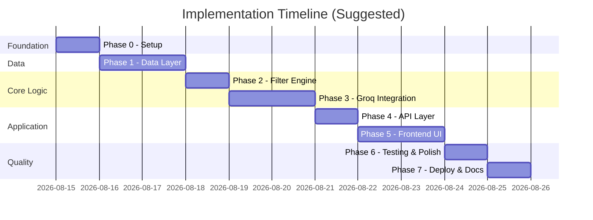
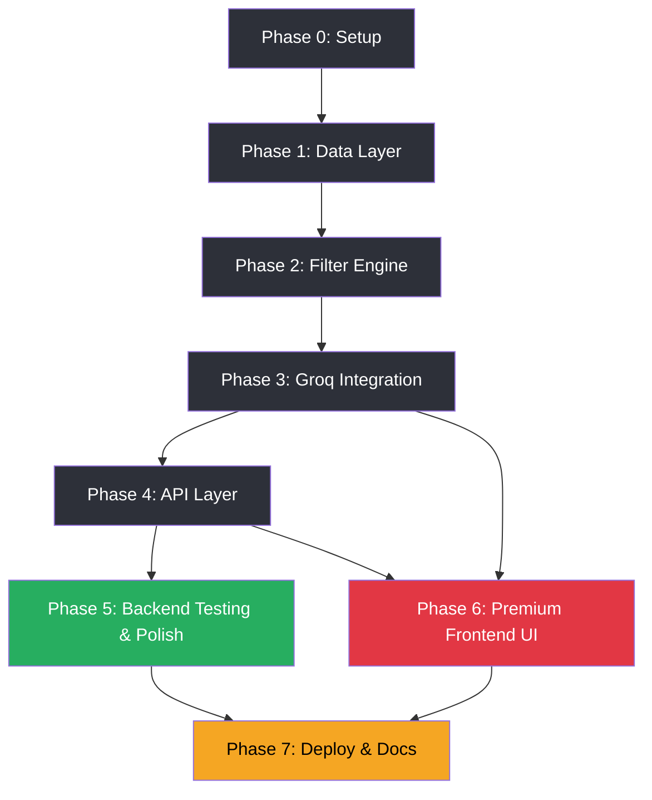

# Phase-Wise Implementation Plan

> AI-Powered Restaurant Recommendation System (Zomato Use Case)

**Sources:** [`context.md`](./context.md) · [`architecture.md`](./architecture.md) · [`edge-case.md`](./edge-case.md) · [`problemStatement.txt`](./problemStatement.txt)

---

## Overview

This plan breaks the project into **7 phases**, ordered by dependency. Each phase has clear tasks, deliverables, and acceptance criteria mapped to the [success criteria](./context.md#success-criteria) in `context.md`.



**Estimated total:** 8–11 working days for a solo developer (MVP with Streamlit).

---

## Phase Summary

| Phase | Name | Goal | Success Criteria Covered |
|-------|------|------|--------------------------|
| 0 | Project Setup | Repo, deps, config, env | — |
| 1 | Data Layer | Load & normalize Hugging Face dataset | #2 |
| 2 | Filter Engine | Hard-filter restaurants by preferences | #3 |
| 3 | Groq Integration | Rank, explain, parse LLM output | #4 |
| 4 | API Layer | Expose REST endpoints | #1, #3, #4 |
| 5 | Frontend UI | Streamlit form + results display | #1, #5 |
| 6 | Testing & Polish | Tests, fallbacks, error states | All |
| 7 | Deployment & Docs | README, deploy, demo-ready | All |

---

## Phase 0: Project Setup & Environment

**Goal:** Establish project skeleton, dependencies, and configuration so later phases can build on a consistent foundation.

**Duration:** ~0.5–1 day

### Tasks

| # | Task | File(s) |
|---|------|---------|
| 0.1 | Create directory structure per architecture | `src/`, `src/models/`, `src/data/`, `src/services/`, `src/api/`, `tests/` |
| 0.2 | Add `requirements.txt` with pinned deps | `requirements.txt` |
| 0.3 | Create `.env.example` with Groq vars | `.env.example` |
| 0.4 | Implement `config.py` — load env vars | `src/config.py` |
| 0.5 | Add `.gitignore` (`.env`, `__pycache__`, HF cache) | `.gitignore` |
| 0.6 | Obtain Groq API key from [console.groq.com](https://console.groq.com) | — |

### Dependencies to install

```
datasets
pandas
fastapi
uvicorn
streamlit
groq
pydantic
python-dotenv
pytest
```

### Configuration contract

| Variable | Required | Default |
|----------|----------|---------|
| `GROQ_API_KEY` | Yes | — |
| `GROQ_MODEL` | No | `llama-3.3-70b-versatile` |
| `MAX_CANDIDATES` | No | `20` |
| `BUDGET_LOW_MAX` | No | `500` |
| `BUDGET_MEDIUM_MAX` | No | `1500` |

### Deliverables

- [x] Runnable empty project with `src/` layout
- [x] `config.py` reads `GROQ_API_KEY` and fails fast if missing
- [x] `.env.example` documented for teammates

### Verification

```bash
python -c "from src.config import settings; print(settings.groq_model)"
```

---

## Phase 1: Data Layer

**Goal:** Load the Zomato dataset from Hugging Face, preprocess it, and expose normalized `Restaurant` objects.

**Duration:** ~1–2 days

**Maps to:** Success criterion #2 — *System loads and uses the real Zomato dataset from Hugging Face.*

### Tasks

| # | Task | File(s) |
|---|------|---------|
| 1.1 | Define `Restaurant` dataclass | `src/models/restaurant.py` |
| 1.2 | Implement Hugging Face dataset loader | `src/data/loader.py` |
| 1.3 | Implement preprocessor (clean, normalize, budget tiers) | `src/data/preprocessor.py` |
| 1.4 | Cache loaded restaurants in memory at startup | `src/data/loader.py` or `src/services/cache.py` |
| 1.5 | Expose `get_cities()` and `get_cuisines()` helpers | `src/data/loader.py` |
| 1.6 | Write unit tests for preprocessor | `tests/test_preprocessor.py` |

### Preprocessing checklist

1. Load dataset: `ManikaSaini/zomato-restaurant-recommendation`
2. Map raw columns → canonical schema (`name`, `location`, `cuisines`, `rating`, `cost_for_two`, `budget_tier`)
3. Normalize location strings (trim, consistent casing)
4. Split comma-separated cuisines into `list[str]`
5. Coerce rating to `float`; drop invalid rows
6. Parse cost string → derive `budget_tier` (`low` ≤ ₹500, `medium` ≤ ₹1500, `high` > ₹1500)
7. Drop rows missing `name` or `location`

### Deliverables

- [x] `DatasetLoader.load()` returns `list[Restaurant]`
- [x] `get_cities()` returns sorted unique cities
- [x] `get_cuisines()` returns sorted unique cuisines
- [x] Preprocessor tests pass

### Verification

```python
from src.data.loader import DatasetLoader

loader = DatasetLoader()
restaurants = loader.load()
print(f"Loaded {len(restaurants)} restaurants")
print(f"Cities: {loader.get_cities()[:5]}")
print(f"Sample: {restaurants[0]}")
```

### Acceptance criteria

- Dataset loads without manual CSV download
- At least one restaurant per major city (Bangalore, Delhi, etc.)
- Budget tiers assigned to ≥ 80% of records (log count of unmapped)

---

## Phase 2: Filter Engine

**Goal:** Deterministically narrow the restaurant corpus based on user preferences before any Groq call.

**Duration:** ~1 day

**Maps to:** Success criterion #3 — *Relevant restaurants are filtered before being sent to the LLM.*

### Tasks

| # | Task | File(s) |
|---|------|---------|
| 2.1 | Define `UserPreferences` dataclass | `src/models/preferences.py` |
| 2.2 | Implement `RestaurantFilter` with ordered pipeline | `src/services/filter.py` |
| 2.3 | Implement candidate selection (sort by rating, cap at `MAX_CANDIDATES`) | `src/services/filter.py` |
| 2.4 | Implement filter relaxation fallback (cuisine → budget → min_rating) | `src/services/filter.py` |
| 2.5 | Write unit tests for each filter rule | `tests/test_filter.py` |

### Filter pipeline (apply in order)

1. **Location** — case-insensitive match on city/location
2. **Rating** — `rating >= min_rating`
3. **Cuisine** — partial match if cuisine provided
4. **Budget** — `budget_tier == user.budget`

### Deliverables

- [x] `RestaurantFilter.filter(restaurants, preferences)` returns filtered list
- [x] `select_candidates(filtered, max_n=20)` returns top-rated subset
- [x] Relaxation logic returns `filters_relaxed: list[str]` when applied
- [x] All filter unit tests pass

### Verification

```python
from src.models.preferences import UserPreferences
from src.services.filter import RestaurantFilter

prefs = UserPreferences(location="Bangalore", budget="medium", cuisine="Italian", min_rating=4.0)
candidates = RestaurantFilter().filter(restaurants, prefs)
print(f"Candidates: {len(candidates)}")
```

### Acceptance criteria

- Bangalore + medium budget returns non-empty list
- Impossible combo triggers relaxation and reports which filter was dropped
- Candidate list never exceeds `MAX_CANDIDATES`

---

## Phase 3: Groq Integration Layer

**Goal:** Build the prompt pipeline, call Groq for ranking/explanations, and parse structured JSON responses.

**Duration:** ~1–2 days

**Maps to:** Success criterion #4 — *LLM returns ranked recommendations with human-readable explanations.*

### Tasks

| # | Task | File(s) |
|---|------|---------|
| 3.1 | Define `Recommendation` and `RecommendationResponse` models | `src/models/recommendation.py` |
| 3.2 | Implement `GroqLLMClient` | `src/services/llm_client.py` |
| 3.3 | Implement `PromptBuilder` (system + user prompts) | `src/services/prompt_builder.py` |
| 3.4 | Implement `ResponseParser` (JSON extract, validate, anti-hallucination) | `src/services/response_parser.py` |
| 3.5 | Implement deterministic fallback (rating-sorted + template explanation) | `src/services/response_parser.py` |
| 3.6 | Implement `RecommendationService` orchestrator | `src/services/recommendation.py` |
| 3.7 | Write tests for prompt builder and parser (mock Groq) | `tests/test_prompt_builder.py` |

### Groq client requirements

- Model: `llama-3.3-70b-versatile` (configurable via `GROQ_MODEL`)
- `temperature=0.3`
- `response_format={"type": "json_object"}`
- Retry once on timeout or rate limit

### Prompt design rules

- Instruct model to **only** recommend from provided candidate list
- Request JSON schema: `summary`, `recommendations[{restaurant_name, rank, cuisine, rating, estimated_cost, explanation}]`
- Include user preferences and serialized candidates in user prompt

### Response parser rules

1. Strip markdown code fences if present
2. Validate JSON schema
3. Reject restaurant names not in candidate list
4. Enrich missing fields from dataset records
5. On failure → retry once → fallback to deterministic ranking

### Deliverables

- [x] End-to-end `RecommendationService.recommend(preferences)` works with live Groq call / deterministic fallback
- [x] Parser rejects hallucinated restaurant names
- [x] Fallback path works when Groq is unavailable (mock test)
- [x] Prompt builder tests pass

### Verification

```python
from src.services.recommendation import RecommendationService

service = RecommendationService()
result = service.recommend(prefs)
print(result.summary)
for rec in result.recommendations:
    print(f"#{rec.rank} {rec.restaurant_name} — {rec.explanation}")
```

### Acceptance criteria

- Returns top 5 recommendations with all required fields
- Each explanation references user preferences (location, budget, or cuisine)
- No restaurant in output that wasn't in the candidate list
- Response time < 10 s for typical query

---

## Phase 4: API Layer

**Goal:** Expose the recommendation pipeline as a FastAPI REST service with validation and error handling.

**Duration:** ~1 day

**Maps to:** Success criteria #1, #3, #4 — programmatic access to preferences input and recommendations.

### Tasks

| # | Task | File(s) |
|---|------|---------|
| 4.1 | Define Pydantic request/response schemas | `src/api/schemas.py` |
| 4.2 | Implement route handlers | `src/api/routes.py` |
| 4.3 | Wire FastAPI app with startup dataset load | `src/main.py` |
| 4.4 | Add `/health`, `/metadata/cities`, `/metadata/cuisines` | `src/api/routes.py` |
| 4.5 | Add `/recommendations` POST endpoint | `src/api/routes.py` |
| 4.6 | Map errors to HTTP status codes (400, 404, 502, 503) | `src/api/routes.py` |

### API endpoints

| Method | Path | Description |
|--------|------|-------------|
| `GET` | `/health` | Health check + dataset loaded status |
| `GET` | `/metadata/cities` | Available cities |
| `GET` | `/metadata/cuisines` | Available cuisines |
| `POST` | `/recommendations` | Generate recommendations |

### Request schema

```json
{
  "location": "Bangalore",
  "budget": "medium",
  "cuisine": "Italian",
  "min_rating": 4.0,
  "additional_preferences": "family-friendly"
}
```

### Deliverables

- [ ] FastAPI app starts with `uvicorn src.main:app --reload`
- [ ] OpenAPI docs available at `/docs`
- [ ] All four endpoints functional
- [ ] Invalid input returns `400` with descriptive message

### Verification

```bash
uvicorn src.main:app --reload --port 8000

curl http://localhost:8000/health
curl http://localhost:8000/metadata/cities
curl -X POST http://localhost:8000/recommendations \
  -H "Content-Type: application/json" \
  -d '{"location":"Bangalore","budget":"medium","cuisine":"Italian","min_rating":4.0}'
```

### Acceptance criteria

- API returns valid JSON matching `RecommendationResponse` schema
- `filters_relaxed` populated when relaxation occurred
- Groq errors return `502` with user-safe message

---

## Phase 5: Backend Testing, Error Handling & Polish

**Goal:** Harden the backend pipeline with comprehensive tests, fallback verification, logging, and edge-case handling — ensuring a production-grade backend before building the UI.

**Duration:** ~1 day

**Maps to:** All success criteria — quality gate for the backend before frontend work begins.

### Tasks

| # | Task | File(s) |
|---|------|---------|
| 5.1 | Complete unit test suite (filter, preprocessor, prompt builder, parser) | `tests/` |
| 5.2 | Add integration test for full pipeline (mock Groq) | `tests/test_recommendation.py` |
| 5.3 | Verify all error scenarios from architecture §14 | — |
| 5.4 | Add structured logging (dataset load, filter counts, Groq latency) | `src/` |
| 5.5 | Tune prompt based on sample outputs | `src/services/prompt_builder.py` |
| 5.6 | Manual QA with 5+ diverse preference combinations via API | — |

### Error scenarios to verify

| Scenario | Expected behavior |
|----------|-------------------|
| Dataset load fails | `503`, retry on next request |
| No filter matches | Relax filters, notify in `filters_relaxed` |
| Groq timeout | Retry once → deterministic fallback |
| Invalid JSON from Groq | Retry with stricter prompt → fallback |
| Hallucinated restaurant name | Rejected by parser |
| Missing `GROQ_API_KEY` | Warn at startup, fallback mode active |
| Groq rate limit (429) | Retry with exponential backoff → fallback |

### Deliverables

- [x] `pytest` passes all tests (94 tests covering all modules)
- [x] Deterministic fallback produces usable results without Groq key
- [x] Structured logs help debug filter counts and response times
- [x] Manual QA checklist completed with 13 diverse queries (all passed)

### Verification

```bash
pytest tests/ -v --tb=short
```

### Acceptance criteria

- Test coverage on filter, preprocessor, parser, API routes (no Groq key needed for CI)
- End-to-end API demo works with 3+ different location queries
- No crashes on edge inputs (empty cuisine, `min_rating=0`, long `additional_preferences`)
- All API error codes return clean JSON error responses

---

## Phase 6: Premium Frontend UI (Streamlit)

**Goal:** Build a visually stunning, modern, and user-friendly Streamlit frontend that delivers a premium experience for discovering restaurants — not a basic form-and-table MVP, but a polished product-grade interface.

**Duration:** ~2–3 days

**Maps to:** Success criteria #1, #5 — *User can input preferences* and *output displayed clearly with all required fields.*

### Design Philosophy

The frontend should feel like a **premium food-discovery app** — think Zomato/Yelp quality, not a developer prototype. Every interaction should feel intentional, polished, and delightful.

### 6A — Visual Design System

#### Color Palette

| Token | Light Mode | Dark Mode | Usage |
|-------|-----------|-----------|-------|
| `--bg-primary` | `#FAFAFA` | `#0F1117` | Page background |
| `--bg-card` | `#FFFFFF` | `#1A1C23` | Card surfaces |
| `--accent` | `#E23744` | `#FF4154` | Zomato-red accent, CTAs |
| `--accent-hover` | `#CB202D` | `#FF6B7A` | Button hover states |
| `--text-primary` | `#1C1C1C` | `#FAFAFA` | Headings |
| `--text-secondary` | `#636E72` | `#A0A8B4` | Body text, labels |
| `--gold` | `#F5A623` | `#FFD166` | Star ratings, rank badges |
| `--success` | `#27AE60` | `#2ECC71` | Success indicators |
| `--border` | `#E8E8E8` | `#2D3039` | Subtle dividers |

#### Typography

- **Headings:** `'Outfit', sans-serif` — bold, modern geometric
- **Body:** `'Inter', sans-serif` — highly readable, clean
- **Load via:** Google Fonts CDN in custom CSS

#### Spacing & Radius

- Card border-radius: `16px`
- Button border-radius: `12px`
- Consistent spacing scale: `4 / 8 / 12 / 16 / 24 / 32 / 48px`

### 6B — Component Hierarchy

```
App
├── CustomCSS                     (inject full design system via st.markdown)
├── Header
│   ├── Logo + App Title          ("🍽️ Zomato AI Recommender")
│   ├── Subtitle / Tagline        ("Discover your next favourite restaurant")
│   └── Groq Status Badge         (green dot = live AI / amber = fallback mode)
│
├── Sidebar: PreferenceForm
│   ├── SectionHeader             ("Your Preferences")
│   ├── LocationSelect            (searchable dropdown, 62 cities)
│   ├── BudgetSelector            (3 styled pill buttons: ₹ / ₹₹ / ₹₹₹)
│   ├── CuisineSelect             (searchable dropdown, "Any" default)
│   ├── RatingSlider              (styled slider 0.0–5.0, step 0.5)
│   ├── AdditionalPrefsTextarea   (placeholder: "e.g. rooftop, family-friendly")
│   └── SubmitButton              (gradient accent, full-width, hover animation)
│
├── MainContent
│   ├── WelcomeHero               (shown before first search)
│   │   ├── Illustration/Icon     (food-themed visual)
│   │   └── GuidanceText          ("Select your preferences and hit Recommend")
│   │
│   ├── LoadingState              (shown during inference)
│   │   ├── AnimatedSpinner       (Lottie or CSS pulsing dots)
│   │   └── ProgressText          ("Finding the best restaurants for you...")
│   │
│   ├── ResultsPanel              (shown after successful recommendation)
│   │   ├── SummaryBanner
│   │   │   ├── AIInsightText     (LLM summary or fallback summary)
│   │   │   ├── ResultCount       ("5 recommendations from 1,606 matches")
│   │   │   └── RelaxationAlert   (amber banner if filters were relaxed)
│   │   │
│   │   ├── RecommendationCards   (grid or stacked layout)
│   │   │   └── RestaurantCard (×N)
│   │   │       ├── RankBadge         (gold circular badge: #1, #2, ...)
│   │   │       ├── RestaurantName    (large, bold heading)
│   │   │       ├── CuisineTags       (colored pill chips per cuisine)
│   │   │       ├── RatingStars       (★★★★☆ visual + numeric)
│   │   │       ├── CostLabel         (₹ amount with budget tier icon)
│   │   │       ├── LocationPin       (📍 locality name)
│   │   │       └── ExplanationText   (italic, AI-generated insight)
│   │   │
│   │   └── FallbackNotice        (subtle banner if deterministic mode used)
│   │
│   └── EmptyState                (shown when 0 results)
│       ├── EmptyIllustration     (friendly "no results" visual)
│       └── GuidanceText          ("Try a different location or broaden your filters")
│
└── Footer
    ├── TechStack Badge           ("Powered by Groq LLaMA 3.3 + Zomato Dataset")
    └── DatasetInfo               ("51,717 restaurants • 62 localities")
```

### 6C — Tasks

| # | Task | File(s) |
|---|------|---------|
| 6.1 | Create Streamlit app shell with page config and layout | `app.py` |
| 6.2 | Implement full custom CSS design system (colors, typography, cards, animations) | `app.py` (inline CSS via `st.markdown`) |
| 6.3 | Build sidebar `PreferenceForm` with styled inputs and budget pill buttons | `app.py` |
| 6.4 | Populate dropdowns dynamically from `DatasetLoader` (cities, cuisines) | `app.py` |
| 6.5 | Build `WelcomeHero` state (pre-search landing with visual and guidance) | `app.py` |
| 6.6 | Build `LoadingState` with animated spinner and progress text | `app.py` |
| 6.7 | Build `ResultsPanel` with `SummaryBanner` and recommendation card grid | `app.py` |
| 6.8 | Implement `RestaurantCard` with rank badge, cuisine pills, star rating, cost, explanation | `app.py` |
| 6.9 | Build `EmptyState` with friendly guidance for zero-result scenarios | `app.py` |
| 6.10 | Add `RelaxationAlert` banner when filters were relaxed | `app.py` |
| 6.11 | Add `FallbackNotice` when deterministic mode is active (no Groq) | `app.py` |
| 6.12 | Add footer with tech stack badge and dataset stats | `app.py` |
| 6.13 | Integration: wire form submission → `RecommendationService` → results display | `app.py` |
| 6.14 | Polish: hover effects, transitions, micro-animations on cards | `app.py` |
| 6.15 | Error handling: catch all exceptions, show user-friendly error messages | `app.py` |

### 6D — Interaction Design

| State | Visual Treatment |
|-------|-----------------|
| **Pre-search (Welcome)** | Hero section with food illustration, tagline, and gentle CTA arrow pointing to sidebar |
| **Loading** | Cards area replaced with pulsing skeleton or animated spinner + "Finding restaurants..." text |
| **Results (LLM)** | Summary banner (green accent border) + ranked cards with staggered fade-in animation |
| **Results (Fallback)** | Same cards + subtle amber "AI offline — showing top-rated matches" notice |
| **Relaxation** | Amber alert banner above cards: "We relaxed [budget, cuisine] to find more options" |
| **Empty (0 results)** | Centered empty-state illustration + "No restaurants found for [location]. Try broadening your filters." |
| **Error** | Red error banner with retry suggestion, no stack traces shown to user |

### 6E — Card Design Specification

Each `RestaurantCard` should look like a premium food-app listing card:

```
┌─────────────────────────────────────────────────┐
│  🏅 #1                                          │
│                                                 │
│  The Globe Grub                                 │
│  ─────────────────────────────────              │
│  📍 Marathahalli, Bangalore                     │
│                                                 │
│  [Continental] [Italian] [Asian]    ← pills     │
│                                                 │
│  ★★★★★  4.8/5    💰 ₹1,300 for two             │
│  ─────────────────────────────────              │
│  "Top-rated dining spot offering authentic      │
│   Italian cuisine with outstanding ratings      │
│   that fits your medium budget."                │
│                                                 │
└─────────────────────────────────────────────────┘
```

- **Rank badge**: Gold circular badge, top-left, slightly overlapping card edge
- **Name**: `font-size: 1.3rem`, `font-weight: 700`, `color: var(--text-primary)`
- **Cuisine pills**: Rounded chips with subtle background tint, `font-size: 0.8rem`
- **Rating**: Visual stars (filled/empty) + numeric value in gold
- **Cost**: Rupee symbol with amount, right-aligned
- **Explanation**: Italic, `color: var(--text-secondary)`, separated by thin divider
- **Card hover**: Subtle `translateY(-2px)` lift + soft shadow expansion

### 6F — Integration Approach

**Inline pipeline** — Streamlit calls `RecommendationService` directly (no API hop needed):

```python
from src.services.recommendation import RecommendationService
from src.models.preferences import UserPreferences

service = RecommendationService()
prefs = UserPreferences(location=loc, budget=budget, cuisine=cuisine, min_rating=rating)
result = service.recommend(prefs, target_count=5)
```

This avoids running two servers for the MVP while keeping the FastAPI backend available independently.

### Deliverables

- [x] Streamlit app launches with `streamlit run app.py`
- [x] Custom CSS design system applied (colors, typography, card styles, animations)
- [x] Sidebar form accepts all 5 preference types with styled inputs
- [x] Dropdowns populated dynamically from dataset (62 cities, 107 cuisines)
- [x] Results display as premium restaurant cards with all fields (name, cuisine pills, rating stars, cost, explanation)
- [x] Rank badges (gold #1, #2, ...) visible on each card
- [x] Summary banner shows AI insight + result count
- [x] Loading spinner visible during inference
- [x] Empty state shows friendly guidance to broaden filters
- [x] Relaxation alert banner shown when filters were relaxed
- [x] Fallback mode notice shown when Groq is unavailable
- [x] Error states handled gracefully (no tracebacks shown to user)
- [x] Footer shows tech stack and dataset stats

### Verification

```bash
streamlit run app.py
# Manual test scenarios:
# 1. Bangalore + medium + Italian + 4.0 rating → expect 5 ranked cards
# 2. Koramangala + low + Any cuisine + 0.0 rating → expect budget restaurants
# 3. Bangalore + high + Ethiopian + 4.9 rating → expect relaxation alert
# 4. Zyxwvutsrqp (fake) + medium → expect empty state
# 5. Disconnect Groq key → expect fallback notice
```

### Acceptance criteria

- A non-technical user can get recommendations without using curl / Postman
- First impression is "this looks like a real product" — not a developer prototype
- All five output fields visible per recommendation card
- UI handles Groq unavailability gracefully with readable fallback notice
- Cards have visual hierarchy (rank, name, cuisines, rating, cost, explanation)
- Filter relaxation is communicated clearly to the user

---

## Phase 7: Deployment & Documentation

**Goal:** Package the project for submission/demo with clear setup instructions and optional cloud deployment.

**Duration:** ~0.5–1 day

**Maps to:** Demo-ready deliverable for milestone submission.

### Tasks

| # | Task | File(s) |
|---|------|---------|
| 7.1 | Write `README.md` (setup, env vars, run instructions) | `README.md` |
| 7.2 | Finalize `.env.example` | `.env.example` |
| 7.3 | Add run scripts or Makefile | `Makefile` or `scripts/` |
| 7.4 | Optional: deploy FastAPI to Railway/Render | — |
| 7.5 | Optional: deploy Streamlit to Streamlit Cloud | — |
| 7.6 | Record demo scenario (screenshots or short video) | `docs/` |

### README sections

1. Project overview (link to `docs/context.md`)
2. Architecture summary (link to `docs/architecture.md`)
3. Prerequisites (Python 3.10+, Groq API key)
4. Installation steps
5. Running locally (API + Streamlit)
6. Running tests
7. Environment variables reference
8. Sample API request/response

### Deliverables

- [ ] New developer can run app from README alone in < 15 minutes
- [ ] `.env.example` has all required variables
- [ ] Demo scenario documented (example inputs → expected outputs)

### Verification

- Fresh clone → follow README → working recommendations

---

## Dependency Graph



**Backend track:** Phase 0 → 1 → 2 → 3 → 4 → 5 (complete backend pipeline with tests)
**Frontend track:** Phase 6 depends on Phase 3 (services) and Phase 4 (metadata APIs)
**Both tracks merge** at Phase 7 for final packaging and deployment.

---

## Success Criteria Traceability

| # | Criterion | Completed In | Verification |
|---|-----------|--------------|--------------|
| 1 | User can input all preference types | Phase 6 | Streamlit sidebar form accepts location, budget, cuisine, rating, extras |
| 2 | Uses real Hugging Face Zomato dataset | Phase 1 | `DatasetLoader` loads `ManikaSaini/zomato-restaurant-recommendation` |
| 3 | Filter before LLM | Phase 2 + 3 | Filter runs before `GroqLLMClient.generate()`; ≤20 candidates sent |
| 4 | Groq ranks with explanations | Phase 3 | Each result has rank + explanation; parser validates names |
| 5 | Clear UI output with all fields | Phase 6 | Premium cards show name, cuisine pills, rating stars, cost, explanation |

---

## Risk Register

| Risk | Impact | Mitigation | Phase |
|------|--------|------------|-------|
| Hugging Face dataset schema differs from docs | High | Inspect columns on first load; adjust preprocessor | 1 |
| Cost field unparseable for many rows | Medium | Fallback budget tier via median split | 1 |
| Groq rate limits during demo | Medium | Deterministic fallback; use `llama-3.1-8b-instant` for dev | 3, 5 |
| LLM hallucinates restaurant names | High | Anti-hallucination check in parser | 3 |
| Zero results for valid city | Medium | Filter relaxation + user messaging | 2 |
| Slow first startup (dataset download) | Low | Cache dataset locally; show loading in UI | 1, 6 |
| Streamlit CSS limitations | Medium | Use `st.markdown(unsafe_allow_html=True)` for custom components | 6 |

---

## Definition of Done (MVP)

The MVP is complete when:

- [ ] All 7 phases delivered
- [ ] All 5 success criteria verified
- [ ] `pytest` passes (≥50 tests)
- [ ] Streamlit demo runs end-to-end with Groq (and gracefully without)
- [ ] Frontend looks premium — not a basic developer prototype
- [ ] README enables setup without author assistance
- [ ] No secrets committed to git

---

## Optional Post-MVP Enhancements

From [`architecture.md` §17](./architecture.md#17-future-extensions):

| Enhancement | Effort | Value |
|-------------|--------|-------|
| React / Next.js frontend | 3–5 days | Full production SPA |
| Vector search on `additional_preferences` | 2–3 days | Better soft matching |
| Recommendation caching | 0.5 day | Lower Groq cost |
| Conversation mode (multi-turn) | 2–3 days | Richer UX |
| Feedback loop (thumbs up/down) | 1–2 days | Quality improvement |
| Dark / Light mode toggle | 0.5 day | User preference |

---

*Last updated: August 2026*
